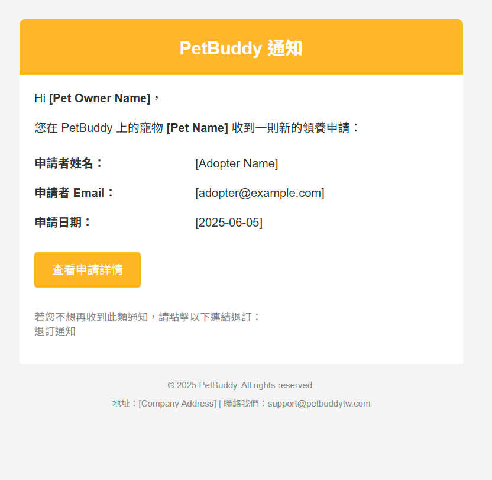
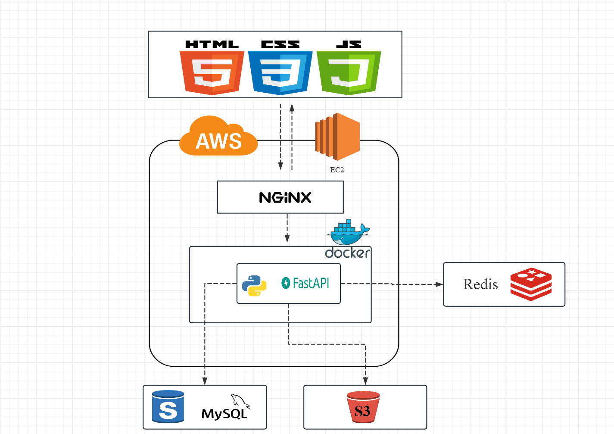

# 🐾 PetBuddy — Pet Adoption Platform

[PetBuddy](https://petbuddytw.com) is a full-stack pet adoption platform that streamlines the process of finding, posting, and adopting pets. The platform supports user authentication, dynamic form creation, image uploads, real-time interaction, and secure communication between adopters and givers.

---

##  Core Features

1. Public and private pet adoption post system  
2. Real-time booking and application form management  
3. Image uploads to AWS S3 with CDN support  
4. Dynamic WYSIWYG-style form builder  
5. JWT-based authentication and role-based access control  
6. Redis-backed caching and task queue for performance and background processing  

---

##  Tech Stack Overview

###  Backend

- **FastAPI**
  - RESTful API design
  - JWT authentication
  - Role-based permission control
- **MySQL**
  - Relational schema design
  - Connection pooling with efficient joins and indexes
- **Redis**
  - In-memory cache for high-performance reads
  - Task and mail queues for background job processing

###  Cloud & Infrastructure

- **AWS EC2** – application hosting  
- **AWS S3** – user image and form uploads  
- **AWS CloudFront** – CDN acceleration  
- **AWS RDS** – managed MySQL database  

###  Frontend

- **JavaScript (ES6+)**
  - Modular MVC architecture
  - Dynamic UI rendering and interaction
- **AJAX / Fetch API**
  - Seamless backend communication
- **HTML5 / SCSS**
  - Responsive UI
  - Mobile-first layout
- **Custom animations & loading indicators**

###  Security

- **JWT (JSON Web Token)** for session control  
- **Permission logic** for form access and adoption rights  
- **Input validation** and sanitization on both ends

---

##  Highlights

- **Dynamic Form Builder**  
  Users can create customizable forms (text, choices, image uploads) with validation and ordering logic.

- **Role-based Form Access**  
  Only adopters who have liked a post can fill out the application; only form owners can view results.

- **Background Image Upload with S3**  
  Upload pet images using background tasks, storing only URLs in the database.  

- **Redis-based Email Notification System**  
  Automatically send mail upon adoption form submission or approval status changes.  
  

- **Real-Time Interaction**  
  Integrated WebSocket logic for future notification system—track likes, form views, and submission updates.

---

##  Architecture Overview

- Frontend serves dynamic pages with filterable pet listings
- Backend handles authentication, adoption logic, form CRUD
- Redis + MySQL combined to enable high-speed interactions with consistency
- All user assets (images) routed through CloudFront with caching  
  

---

##  Workflow Overview

###  Form Submission Flow

1. User clicks like on a pet post
2. Gains permission to fill out dynamic form
3. Submits data, including images
4. Background task uploads to S3 & stores URL in DB
5. Redis queues email notification for sender

###  Background Processing

- Task workers monitor Redis queues
- Handle:
  - Image uploads
  - Mail sending
  - Post-adoption status updates
